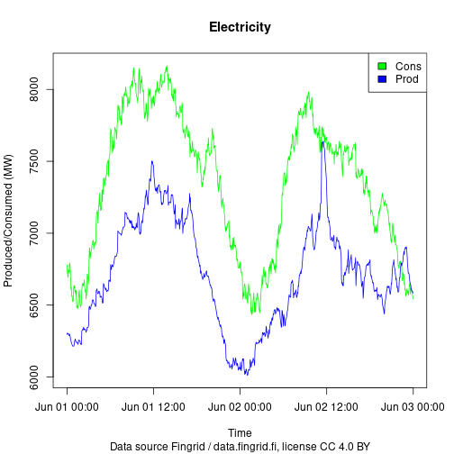

``` r
library(finnishgrid)
```

Read basic API specification at https://data.fingrid.fi/en/instructions and
register a free user account.

Optional: add API key as your environment variable (~/.Renviron)


``` bash
FINGRID_OPENDATA_API_KEY=MY_SECRET_KEY_FROM_API_PAGES
```

## Setting time range with UTC, and API user key


``` r
start_time_utc = "2024-06-01T00:00:00.000Z"
end_time_utc = "2024-06-03T00:00:00.000Z"
user_key = NA  # TODO: replace with right key or use .Renviron file
```

## Fetching data with helper functions

Let's get Finnish hourly electricity consumption and production time-series
data for basic visualization.


``` r
elec_cons <- powersys_electricity_consumption_FI_RTD(start_time_utc = start_time_utc,
                                            end_time_utc = end_time_utc,
                                            user_key = user_key)
Sys.sleep(1)

elec_prod <- powersys_electricity_production_FI_RTD(start_time_utc = start_time_utc,
                                           end_time_utc = end_time_utc,
                                           user_key = user_key)
Sys.sleep(1)

min_elec_cons <- min(elec_cons$value)  # consumption
max_elec_cons <- max(elec_cons$value)

min_elec_prod <- min(elec_prod$value)  # production
max_elec_prod <- max(elec_prod$value)

y_max <- max(max_elec_cons, max_elec_prod)
y_min <- min(min_elec_cons, min_elec_prod)
```

## Basic data visualization


``` r
plot(elec_cons$start_time, elec_cons$value, type = 'l',
     col = "green", ylim = c(y_min, y_max),
     ylab = "Produced/Consumed (MW)",
     xlab = "Time", main = "Electricity",
     sub = "Data source Fingrid / data.fingrid.fi, license CC 4.0 BY")
lines(elec_prod$start_time, elec_prod$value, type = 'l', col = "blue")
legend("topright", c("Cons", "Prod"), fill = c("green", "blue"))
```



## Get electricity consumption in Finland with get_data() function

API page: https://data.fingrid.fi/en/datasets/193


``` r
tmp <- get_data(api_number = 193,  # energy consumption
                start_time_utc = start_time_utc,
                end_time_utc = end_time_utc,
                user_key = user_key)
summary(tmp)
#>  start_time_utc                 end_time_utc                     value            id     
#>  Min.   :2024-06-01 00:00:00   Min.   :2024-06-01 00:03:00   Min.   :6434   Min.   :193  
#>  1st Qu.:2024-06-01 11:59:15   1st Qu.:2024-06-01 12:02:15   1st Qu.:6914   1st Qu.:193  
#>  Median :2024-06-01 23:58:30   Median :2024-06-02 00:01:30   Median :7441   Median :193  
#>  Mean   :2024-06-01 23:58:30   Mean   :2024-06-02 00:01:30   Mean   :7347   Mean   :193  
#>  3rd Qu.:2024-06-02 11:57:45   3rd Qu.:2024-06-02 12:00:45   3rd Qu.:7726   3rd Qu.:193  
#>  Max.   :2024-06-02 23:57:00   Max.   :2024-06-03 00:00:00   Max.   :8166   Max.   :193
```
